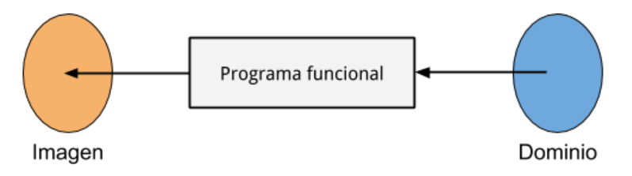
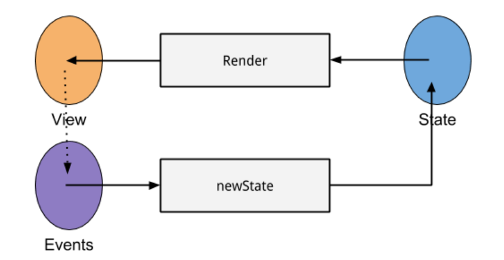
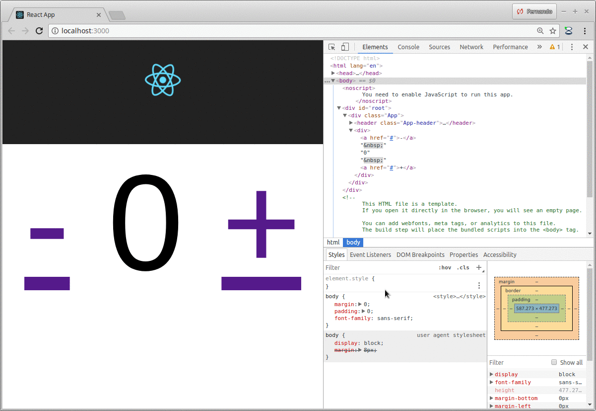

Este proyecto fue creado con [Create React App (CRA)](https://github.com/facebookincubator/create-react-app).

# Contador

El contador es un componente de una tecnología llamada React, que tiene

- una estructura contador, con un valor numérico entero
- funciones para sumar o restar el contador
- una parte visual en HTML, definida en la función render

En funcional, un programa es una función o transformación que dado un dominio devuelve una imagen. 



En React, tenemos como origen un _state_: el estado de una aplicación, que es inicialmente un contador

```javascript
this.state = {
    contador: 0
}
```

Cuando se inicializa un estado, esto muestra (_renderiza_ la vista) HTML, que tiene dos links (tags _a href_) y un label (que no necesita un tag específico aunque podría ser un _span_ o un _p_ - párrafo):

```html
<div>
    <a href="#" onClick={(event) => { this.restar() }}>-</a>
    {this.state.contador}
    <a href="#" onClick={(event) => { this.sumar() }}>+</a>
</div>
```

¿Qué ocurre cuando un usuario presiona el link? Se ejecuta el código del evento onClick, que si lo miramos bien

```javascript
(event) => { this.sumar() }
```

no es otra cosa que una expresión lambda. Esto llama a la función sumar() 

```javascript
sumar() {
    this.cambiarContador(this.state.contador + 1)
}

cambiarContador(n) {
    this.setState({contador: n})
}
```

Lo que hace sumar() es **crear un nuevo estado**, a partir del estado actual: toma el valor del contador, le suma uno y lo inyecta al nuevo estado. No modifica el estado existente, sino que lo transforma:

estado { contador : 3 }  ======>  pasa a estado { contador : 4 }

Vemos el diagrama:



¿Y por qué **reactiva**?

Porque solo se modifica en el browser el valor que cambió, como vemos a continuación:

